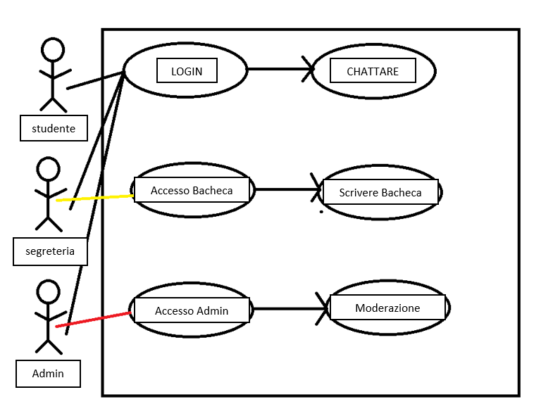

# Documentazione progetto Chat
1. Introduzione
- Informazioni sul progetto
- Abstract
- Scopo
1. Analisi
- Analisi del dominio
- Analisi dei mezzi
- Analisi e specifica dei requisiti
- Use case Pianificazione
1. Progettazione
- Design dell'architettura del sistema
- Design dei dati e database 
1. Implementazione
2. Test
- Protocollo di test
- Risultati test
- Mancanze/limitazioniu conosciute
1. Consuntivo
2. Conclusioni
- Sviluppi futuri
- Considerazioni personali
1. Sitografia
2. Allegati

# Introduzione
## Docenti di riferimento e responsabile progetto
 - Luca Muggiasca(responsabile di progetto).
 - Geo Pretirni(docente di riferimento).
### Scuola
- Scuola Arti e Mestieri di Trevano.
### Sezione 
- Informatica. 
### Anno
- Terzo.
### Modulo
- 306, Sviluppo progetti.
### Date
- Data di inizio: 02.09.2021
- Data di consegna progetto : 23.12.2021

# Abstract
Nell'ambiente scolastico della scuola arti e mestieri di Trevano non è attualmente presente nessuno tipo di contatto tra i vari studenti se non quello 
fisico tra i corridoi, nelle aulee o nei piazzali. La realizzazione di questo progetto punta a creare un sistema di messaggistica per coloro che sono 
registrati all'interno del sistema. Durante questi 3 mesi di lavoro cercherò di portare a termine un sistema con cui tutti gli allievi della scula
potranno comunicare in sicurezza ed in ogni momento. Il prodotto finale punta ad essere applicabile a qualunque sistema dotato di un AD(active directory)
in cui siano registrate delle persone con l'obbiettivo di poter accorciare i tempi di comunicazioni e di ridurre le barriere sociali scolastiche.
Il prodotto finale sarà un'applicazione web realizzata con ReastJS ed un sistema di memorizzazione dati ad ogetti(MongoDB).

# Scopo 
Questo primo progetto individuale non solo punta ad ampliare le conoscenze tecniche ma servirà da base di esperienza per poi realizzare il lavore di diploma 
del quarto anno. Inoltre grazie a quest'erperienza sarò in grado di combinare molti aspetti teorici appresi fin'ora come la creazione di database, la costruzione 
di interfacce web con linguaggi di markUp, la messa in piedi di strutture di comunicazione e hosting come server e web server ed infine questo lavoro mi insegnerà
cosa significa lavorare ad un ipotetico progetto in una ditta e di come affrontare e documentare ogni passaggio.

# Analsi

## Analisi del dominio
Ci sono molte applicazioni di messaggistica ai giorni d'oggi che offrono anche molte altre possibilità come le funzioni di messaggistica vocale , video etc..
Questo sistema si baserà sull'AD(active directory) scolastica e sarà in grado di fornire all'utente un ambiente accessibile solo ai membri del sistema scolastico per lo scambio di informazioni.

## Analisi e specifica dei requisiti
Il committente ha richiesto un applicativo web basato su un sistema di immagazzinamento dati ad oggetti. L'applicativo deve permettere ad un utente di poter comunicare all'interno di canali che possono essere aggiunti o tolti a piacimento.L'applicativo dispone di una gestione amministrativa dove gli utenti amministratori avranno accesso a delle funzionalità di moderazione aggiuntive quali: ban, monitoraggio log e broadcast di messaggi.

| ID  | REQUISITO 1    | 
| :------------- | :----------: |
| VERSIONE |  1.0  | 
| NOME | CREAZIONE DATABASE    | 
| SUB ID | REQUISITO    |
|  01| il database deve essere ad oggetti. |  
|  02| il database deve essere in MongoDB  | 

| ID  | REQUISITO 2   | 
| :------------- | :----------: |
| PRIORITÀ | 1|
|  NOME| CREAZIONE WEB INTERFACE   | 
| SUB ID | REQUISITO    |
|  01| Deve essere dinamicaa, moderna e accessibile|  

| ID  | REQUISITO 3   | 
| :------------- | :----------: |
| PRIORITÀ | 1|
|  NOME| AGGIUNTA/ELIMINAZIONE CANALI   | 
| SUB ID | REQUISITO    |
|  01| Poter aggiungere o togliere dei canali testuali|

| ID  | REQUISITO 4  | 
| :------------- | :----------: |
| PRIORITÀ | 1|
|  NOME| ELIMINAZIONE MESSAGGI   | 
| SUB ID | REQUISITO    |
|  01|Possibilità di eliminare i messaggi |
|  02| PRIORITÀ 2 |
|    | Log di eliminazione messaggi |  

| ID  | REQUISITO 5   | 
| :------------- | :----------: |
| PRIORITÀ | 1|
|  NOME| MESSAGGIO BROADCAST   | 
| SUB ID | REQUISITO    |
|  01| Utente amministrativo potrà mandare messagi a tutti tramite la bacheca|  

| ID  | REQUISITO 6   | 
| :------------- | :----------: |
| PRIORITÀ | 1|
|  NOME| AUTENTICAZIONE UTENTE  | 
| SUB ID | REQUISITO    |
|  01| Login con password e nome utente|
|  02| Login con Ldap interno alla scuola   |

| ID  | REQUISITO 8  | 
| :------------- | :----------: |
| PRIORITÀ | 1|
|  NOME| LOG DATABASE  | 
| SUB ID | REQUISITO    |
|  01| Log eliminazione messaggi(Data, ora, utente)|
|  02| Log invio messaggi (Data, ora, utente)  |    

| ID  | REQUISITO 11  | 
| :------------- | :----------: |
| PRIORITÀ | 2|
|  NOME| AUTO ELIMINAZIONE MESSAGGI   | 
| SUB ID | REQUISITO    |
| 01 | Possibilità di impostare un timer per l'auto cancellazione dei messaggi |

| ID  | REQUISITO 10 |  
| :------------- | :----------: |
| PRIORITÀ | 3|
|  NOME| MAPPA UNICODE    | 
| SUB ID | REQUISITO    |
|  01| Un utente deve avere a disposizione tutta la mappa unicode di caratteri per messaggiare| 

| ID  | REQUISITO 11   | 
| :------------- | :----------: |
| PRIORITÀ | 3|
|  NOME| EMOTICON   | 
| SUB ID | REQUISITO    |
|  01| Aggiunta emoticon nelle conversazioni|

| ID  | REQUISITO 12  | 
| :------------- | :----------: |
| PRIORITÀ | 3|
|  NOME| INVIO IMMAGINI   | 
| SUB ID | REQUISITO    |
|  01| Possibilità di incorporare messaggi multimediatici|

## Use Case
 pending.

 ## Pianificazione
 - Per realizzare questo prodotto ho scelto un a programmazione di tipo waterfall che viene illustrata nella seguente immagine tramite le fasi del progetto
  
  

## Analisi requisiti
| Prodotto | Caratteristiche   | 
| :------------- | :----------: |
| Computer| XXX|
| Account Scolastico| nome utente e password | 
| Monitor | XXX|
| Mouse  | XXX |
| Tastiera | XXX |
| Node JS | v16.0.6|
| Visual Studio Code|Editor|
| Insomnia | testing API|
| MongDB | DBMS| 

## Librerie necessarie
 - mongoose
 - React JS
 - Express
 - morgan
 - nodemon
 - bcrypt
 - dotenv
 - helmet

## Progettazione 
 ### Interfaccia Web  
 L'interfaccia web si deve distinguere per essere user friendly, dinamica e con uno stile moderno(segue uno schizzo del risultato finale).
 
  

  Nella barra di sinistra troveremo i canali testuali di ogni utente. in fondo alla lista dei canali troveremo un pulsante per aggiungere delle nuove conversazioni.
  Il riquadro principale a destra sarà invece la finestra di comunicazione tra gli utenti con una barra per scrivere. In fondo a destra della barra troviamo anche un opzione di timing per i messaggi.
  A fianco della barra troviamo 3 tasti
  - invio, per inviare messaggi.
  - gli emoticon, da integrare al messaggio.
  - i file, per importare i file(immagini/GIF/video) nel messaggio.   
  Nella sezione in alto troviamo i 3 normali pulsanti di ogni interfaccia web(ridimensionare, nascondere e chiudere).
  Si trova anche un bottone bacheca che una volta cliccato aprirà una nuova finestra dove potremo vedere gli annunci fatti dalla segreteria.
  Un bottone di logout dal quale un utente potrà disconnettersi ed infine una barra di ricerca per cercare altri utenti con cui messagiare.
  Inoltre, cliccando sul logo dell'utente in alto a sinistra potremo accedere al profilo utente.

### Profilo utente
  

  In questo riquadro troveremo l'immagine profilo dell'utente(di defaul sarà stilizzata) che ognuno potrà cambiare.
  Subito sotto troveremo un riquadro dove un utente potrà inserire Una descrizione personale.
  In alto a sinistra comparirà una freccia per tornare alle chat, funzione che sarà richiamata anche solo cliccando sui canali(posti lateralmente) che non scompariranno.
  in alto a destra(solo per chi avrà i permessi amministratori) troveremo il pulsante per accedere alle impostazioni.

  ### Bacheca
  
  Il riquadro bacheca si aprirà cliccando sopra la voce "bacheca" nel menù principale. Si aprirà una pagina dove vedremo gli annunci della segreteria.
  Gli utenti "segretariato" avranno un ruolo speciale e saranno gli unici a poter scrivere nell'interfaccia della bacheca.

  ### Use case
   
  livello di dettaglio: basso
  
  
  - studente:  
Uno studente una volta fatto l'accesso potrà usare l'applicazione con l'unico scopo di chattare, leggere la bacheca e modificare il proprio profilo.

- segreteria  
Un utente segretariato, effetuato il login, potrà avere accesso alla chat(e dunque a tutte le funzioni disponibili all'utente: studente). Inoltre sarà l'uncio utente ad avere accesso sia in lettura che in scrittura alla bacheca.

- admin/docenti  
  Un utente admin, effetuato il login, potrà avere accesso alla chat(e dunque a tutte le funzioni disponibili all'utente: studente). 
  Avrà accesso ad un pannello amministrativo dal quale potrà:
   - bannare un utente.
   - mandare un warning all'utente.
 

# Implementazione

La fase successiva alla progettazione consiste nella realizzazione dell'applicazione che in questo specifico caso può essere suddivisa in due parti prinicpali:

- REST API , ovvero il back-end dell'applicativo che interagisce con l'applicativo e il database.
- REACT , la parte visiva dell'applicativo.

## REST API

Per questa prima sezione dell'applicativo ho deciso di svilluppare una REST API di modo che l'applicativo avesse un supporto che potesse gestire le 
comunicazioni tra DB, aplicativo WEB e che fosse in grado di poter elaborare le richieste fatte dagli utenti. Per sviluppare il back-end ho usato un alibreria di npm 
chiamata `express` (libreria per la gestione delle richieste http).

- source: `index.js`

In questa immagine vediamo come poter inizializzare l'applicazione fornendogli una connessione con un database a cui facciamo riferimento 
e mettendo in ascolto express su una determinata porta che decidiamo noi: in quest o caso la `8080`.
In questo pezzo di codice inizializziamo anche dei `middelware` che ci permettono di agevolare le comunicazioni tra i vari protocolli.

Una Rest API funziona tramite richieste http e per esempio se nel nostro applicativo volessimo poter fare una richiesta specifica dovremmo 
creare delle `routes` , ovvero dei link a cui risponde il server che abbiamo creato prima. Per richiamare una route usiamo il comando: `app.use("link", route);`
Ogni route ha delle funzioni specifiche che ci permettono di interagire correttamente con l'applicativo:
- Get
- Post
- Delete
- Put
- Patch

